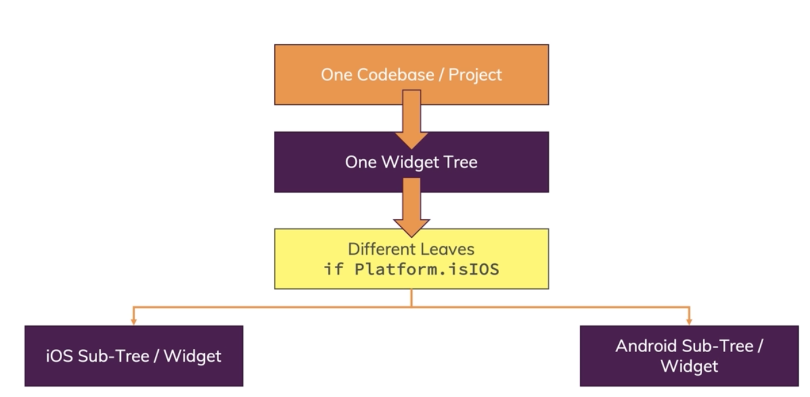

# flutter_real_app

A new Flutter project.

## 1. Containers vs Column / Row

- Container

  - takes exactly one child widget
  - Rich alignment & Styling options
  - Flexible width (e.g child width, available width..)
  - Perfect for custom styling & alignment

- Column / Row
  - takes multiple (unlimited) child widget
  - Alignment but no styling options
  - Always takes full available height(column) / width(row)
  - Must-use if widgets sit next to / above each other

## 2. dart dateformat

- https://pub.dev/packages/intl : This package provides internationalization and localization facilities, including message translation, plurals and genders, date/number formatting and parsing, and bidirectional text.

- 아래 dependecy를 pubspect.yaml 파일에 붙여넣는다.

```
dependencies:
  intl: ^0.16.1
```

- The intl package supports a broad range of date formatting patterns. Here's a list

```
 DAY                          d
 ABBR_WEEKDAY                 E
 WEEKDAY                      EEEE
 ABBR_STANDALONE_MONTH        LLL
 STANDALONE_MONTH             LLLL
 NUM_MONTH                    M
 NUM_MONTH_DAY                Md
 NUM_MONTH_WEEKDAY_DAY        MEd
 ABBR_MONTH                   MMM
 ABBR_MONTH_DAY               MMMd
 ABBR_MONTH_WEEKDAY_DAY       MMMEd
 MONTH                        MMMM
 MONTH_DAY                    MMMMd
 MONTH_WEEKDAY_DAY            MMMMEEEEd
 ABBR_QUARTER                 QQQ
 QUARTER                      QQQQ
 YEAR                         y
 YEAR_NUM_MONTH               yM
 YEAR_NUM_MONTH_DAY           yMd
 YEAR_NUM_MONTH_WEEKDAY_DAY   yMEd
 YEAR_ABBR_MONTH              yMMM
 YEAR_ABBR_MONTH_DAY          yMMMd
 YEAR_ABBR_MONTH_WEEKDAY_DAY  yMMMEd
 YEAR_MONTH                   yMMMM
 YEAR_MONTH_DAY               yMMMMd
 YEAR_MONTH_WEEKDAY_DAY       yMMMMEEEEd
 YEAR_ABBR_QUARTER            yQQQ
 YEAR_QUARTER                 yQQQQ
 HOUR24                       H
 HOUR24_MINUTE                Hm
 HOUR24_MINUTE_SECOND         Hms
 HOUR                         j
 HOUR_MINUTE                  jm
 HOUR_MINUTE_SECOND           jms
 HOUR_MINUTE_GENERIC_TZ       jmv
 HOUR_MINUTE_TZ               jmz
 HOUR_GENERIC_TZ              jv
 HOUR_TZ                      jz
 MINUTE                       m
 MINUTE_SECOND                ms
 SECOND                       s
```

Examples Using the US Locale:

```
 Pattern                           Result
 ----------------                  -------
 new DateFormat.yMd()             -> 7/10/1996
 new DateFormat("yMd")            -> 7/10/1996
 new DateFormat.yMMMMd("en_US")   -> July 10, 1996
 new DateFormat.jm()              -> 5:08 PM
 new DateFormat.yMd().add_jm()    -> 7/10/1996 5:08 PM
 new DateFormat.Hm()              -> 17:08 // force 24 hour time
```

## 3. ListView

- Column -> ListView
- A ListView is scrollable by default
- ListView is the most commonly used scrolling widget
- ListView(children:[])
  - wrapping SingleChildScrollView()
- ListView.builder()
  - only load what's visible
  - 아이템 갯수가 많을 때는 ListView.builder()를 고려해라.

## 4. Useful Resources & Links

- More on Layouting (with Column(), Row() etc). : [https://flutter.dev/docs/development/ui/layout](https://flutter.dev/docs/development/ui/layout)
- More on Images & Assets: [https://flutter.dev/docs/development/ui/assets-and-images](https://flutter.dev/docs/development/ui/assets-and-images)
- Official Widget Catalog: [https://flutter.dev/docs/development/ui/widgets](https://flutter.dev/docs/development/ui/widgets)
- Material Design Docs: [https://material.io/design/](https://material.io/design/)
- Flutter Theming: [https://flutter.dev/docs/cookbook/design/themes](https://flutter.dev/docs/cookbook/design/themes)
- More on MediaQuery & Responsive Layouts: [https://api.flutter.dev/flutter/widgets/MediaQuery-class.html](https://api.flutter.dev/flutter/widgets/MediaQuery-class.html) & [https://stackoverflow.com/questions/49704497/how-to-make-flutter-app-responsive-according-to-different-screen-size?rq=1](https://stackoverflow.com/questions/49704497/how-to-make-flutter-app-responsive-according-to-different-screen-size?rq=1)
- More on LayoutBuilder: [https://api.flutter.dev/flutter/widgets/LayoutBuilder-class.html](https://api.flutter.dev/flutter/widgets/LayoutBuilder-class.html)
- All Cupertino Widgets: [https://flutter.dev/docs/development/ui/widgets/cupertino](https://flutter.dev/docs/development/ui/widgets/cupertino)

## 5. What does "Responsive" Mean?

support different device size (Portrait-mode phone, Landscape-mode phone, Tablet, Desktop PC)

## 6. What does "Adaptive" Mean?

probably diffrent look and feel on IOS and Android

- Android

  - Meterial-Design Look / Styles
  - Android Animations / Route Trainsitions
  - Android Fonts

- iOS
  - Cupertino Look / Styles
  - iOS Animations / Route Transitions
  - iOS Fonts

## 7. Responsive & Adaptive Apps in Flutter



## 8. textScaleFactor

## 9. LayoutBuilder

MediaQuery gives you device information, LayoutBuilder gives you constraints that apply to a widget.

<br>

## 10. Widget Tree vs Element Tree

### 1) Widget Tree

- Configuration(rebuilds frequently) : just a bunch of configuration settings.
- the widget tree is constantly changing basically whenever you call set state, so whenever the build method get executed, Flutter rebuilds that widget tree
- Provide configuration for element and render tree

### 2) Element Tree

- Connect widget and render tree, manage state, update render tree when widget tree changes.
- Links widgets with rendered objects(rarely rebuilds)
- created by Flutter automatically based on widget tree and it links widgets to the actual rendered objects
- The element tree is managed differently and does not rebuild with every call to the build method
- render it to the screen and it does so by looking at the widget at which this element also points which holds all the information you need for painting it to the screen, like a background color, a border the size.

### 3) Render Tree

- Rendered objects on the screen (rarely rebuilds)
- What you see on the screen

<br>

## 11. build method

- build() runs very often and re-builds the widget tree (or parts of it)
- build method is called by flutter whenever your state changes
- build method runs again, new instances of all these classes are created.
- build method를 호출시키는 trigger
- calling set state automatically leads to build being called
- media query or theme will cause your widget to rebuild automatically whenever changes (ex.rotate device, soft keyboard appear)

<image src="./capture2.png" width="600">

splitting your apps efficiently is a good idea but always keep in mind that build calls, the widget tree being rebuilt is generally not problematic and a core functionality of Flutter. and Flutter manages this efficiently to not rebuild the element and the render tree all the time

## 12. 'const' widgets & Constructors

basically all stateless widgets are immutable
using the const keyword in front of classes or class constructors which give you constant objects to avoid unnecessary rebuilds of these widgets in the Flutter widget tree

## 13. ...(Three dots)

add three dots in front of a list or in front of a function or a method that returns a list.
These three dot tell Dart that you want to pull all the elements out of that list and merge them as single elements into that surrounding list which we have.

## 14. Widget Lifecycle

<image src="./capture3.png" width="600">

## 15. App Lifecycle

<image src="./capture4.png" width="600"/>

## 16. Context

- Every widgets has its own context attached to it and that's the context to get in the build method.
- Context holds information about the position of the widget in the overall widget tree
- ex. MediaQuery.of(context), Theme.of(context)

<image src="./capture5.png" width="600"/>

**InheritedWidget**

- get a direct tunnel to the InheritedWidget and to data with help of context. because the context know about the general structure of widget tree. and therefor they can directly access any other widget wiout passing data through arguments(with constructor)

<image src="./capture6.png" width="600"/>
